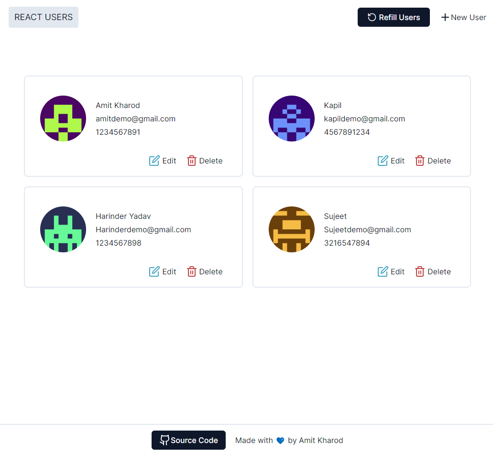
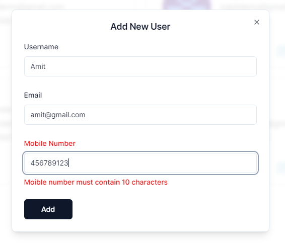

# [React Users](https://reactjs-users.vercel.app/)

A user management web application build with Reactjs.

## Tech Stack

- [ReactJS](https://react.dev/)
- [TypeScript](https://www.typescriptlang.org/)
- [Tailwind CSS](https://tailwindcss.com)
- [Shadcn/ui](https://ui.shadcn.com/)
- [Zod](https://zod.dev/)
- [Mongoose](https://mongoosejs.com/)
- [ExpressJS](https://expressjs.com/)

## Features

- Users CRUD operations using Express API
- Front-end form validation using `zod` and `react-hook-form`
- Skeleton loading using `react-loading-skeleton`

## Installation

### 1. Clone the repository

```bash
git clone https://github.com/Amit-kharod/user-management-reactjs
```
### 2. Go into Client and install dependencies

```bash
cd client
npm install
```

### 3. Create a `.env` file
Create a `.env` file in the client directory and add the environment variables as shown in the `.env.example` file.

### 4. Run client

```bash
npm run dev
```

### 5. Open another terminal and install dependencies inside server

```bash
cd server
npm install
```

### 6. Create a `.env` file

Create a `.env` file in the server directory and add the environment variables as shown in the `.env.example` file.

### 7. Run server 

```bash
npm run start
```

## Screenshots
#### Homepage

[](https://reactjs-users.vercel.app/)
#### Adding new user

[](https://reactjs-users.vercel.app/)
